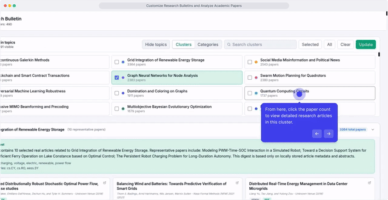
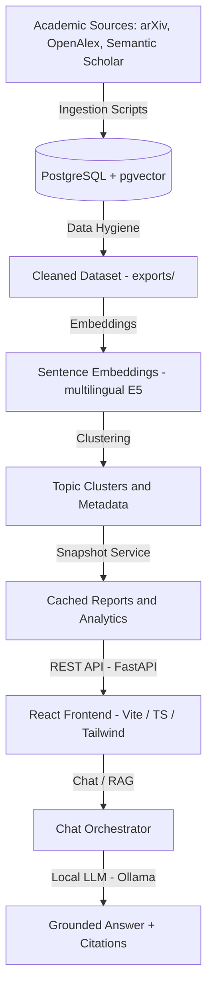

# Academic Literature Intelligence and Analysis Platform

## TL;DR

Academic literature grows faster than researchers can manually follow. This platform helps researchers, students, and research teams turn large paper collections into searchable, clustered, and source-grounded knowledge.

The system combines paper ingestion, semantic retrieval, topic clustering, weekly bulletins, and an AI-assisted Chat experience in one workflow. The chat assistant is designed to answer through RAG over recently ingested academic papers, so responses can be grounded in the local corpus instead of relying on generic model memory.

Primary use cases:

- Literature discovery for students, researchers, and academic project teams.
- Source-grounded question answering over newly collected papers.
- Tracking recent papers, topic clusters, and emerging research directions.
- Generating weekly research briefings from selected categories or clusters.
- Comparing methods, contributions, limitations, and representative papers with citations.

The main value is practical research acceleration: faster literature discovery, clearer topic-level understanding, auditable AI-assisted answers, and repeatable weekly research briefings.

---

## Problem And Our Solution

### Problem

Researchers regularly face three practical issues:

- Academic papers are spread across multiple sources such as arXiv and OpenAlex.
- Tracking recent developments, topic shifts, and representative papers is time-consuming.
- Generic chat systems can answer quickly, but they do not reliably ground claims in a local academic corpus.

### Our Solution

This platform addresses those issues with a single local workflow:

- It ingests academic papers into a structured PostgreSQL database.
- It computes embeddings and supports hybrid retrieval with vector search and BM25.
- It clusters papers into coherent topics for higher-level exploration.
- It provides an AI-assisted Chat interface that uses RAG to answer over current local papers and cites its sources.
- It generates validated weekly bulletins and cluster digests for faster literature review.

### Demo Video



---

## Technology Stack

<p align="left">
  
  
  
  
  
  
  
  
  
  
  
  
  
</p>

### What Each Technology Does

- `FastAPI`: backend API, chat endpoints, analytics, bulletin routes, health endpoints.
- `PostgreSQL + pgvector`: paper storage, metadata filtering, vector similarity retrieval.
- `Ollama`: local LLM runtime for routing, grounded answering, digests, and bulletin writing.
- `sentence-transformers`: embedding generation for documents and queries.
- `BERTopic + UMAP + HDBSCAN`: topic clustering and representative topic analysis.
- `SQLite FTS5 BM25`: lexical sidecar index for hybrid retrieval.
- `React + TypeScript + Vite`: frontend chat and dashboard experience.
- `Docker Compose`: reproducible local delivery and demo environment.

---

## Architecture



---

## Auto Setup

The recommended delivery path is Docker-only.

### Standard Startup

```bash
cp .env.example .env
./setup.sh
```

This will:

- start PostgreSQL, Redis, Ollama, backend, worker, beat, and frontend,
- wait until the backend becomes ready,
- pull and warm the configured Ollama model,
- apply migrations automatically during backend startup.

### First-Time Demo Bootstrap

If you want the project to start with data and prebuilt retrieval artifacts:

```bash
./setup.sh --seed
```

This runs the initial data bootstrap inside Docker and covers:

- ingestion,
- embeddings,
- BM25 index generation,
- clustering,
- snapshot refresh.
---
## Local LLM model selection

AcademicAI-Insight uses Ollama for local assistant responses, research summaries, cluster analysis, and Week's Best bulletin generation.

The active model is configured in the `.env` file:

```env
MODEL_NAME=qwen2.5:3b
```

`MODEL_NAME` must match a model that is installed in the Ollama container.

### Model options by hardware profile

The table below provides approximate model suggestions. Actual performance depends on the selected model tag, quantization level, available RAM/VRAM, context length, and whether the model is loaded fully on GPU or partially on CPU.

| Hardware profile | Models to try | Notes |
|---|---|---|
| CPU only / very low memory | `qwen2.5:1.5b`, `llama3.2:1b`, `gemma3:1b` | Lightweight options for basic testing. |
| Low-end GPU / around 4 GB VRAM | `qwen2.5:3b`, `llama3.2:3b`, `phi4-mini` | Good starting point for local demos and basic research assistance. |
| Mid-range GPU / around 6–8 GB VRAM | `gemma3:4b`, `qwen3:4b`, `qwen2.5:7b` | Better response quality for summaries and cluster analysis. |
| Stronger GPU / around 8–12 GB VRAM | `qwen2.5:7b`, `mistral:7b`, `llama3.1:8b`, `deepseek-r1:7b` | Better suited for paper analysis and bulletin generation. |
| High-memory GPU / around 12–16 GB VRAM | `mistral-nemo:12b`, `qwen2.5:14b`, `deepseek-r1:14b`, `phi4` | Higher-quality responses with higher memory usage. |
| High-end GPU / 24 GB+ VRAM | `qwen2.5:32b`, `deepseek-r1:32b` | Heavier local models; may require more VRAM/RAM depending on quantization and context length. |

For more detailed information about available Ollama models, model tags, parameter sizes, quantization variants, and hardware requirements, see the official Ollama model library:

- [Ollama Model Library](https://ollama.com/library)

### Changing the model

Pull the model first:

```bash
docker compose exec ollama ollama pull qwen2.5:7b
```

Update `.env`:

```env
MODEL_NAME=qwen2.5:7b
```

Restart the system with the updated configuration:

```bash
docker compose down --remove-orphans
docker compose up -d --build
```

Verify installed Ollama models:

```bash
docker compose exec ollama ollama list
```

Check that the backend is ready:

```bash
curl http://127.0.0.1:8000/health/ready
```

---

## Data Operations After Installation

After the system is already installed, data-related operations can be run explicitly with Docker commands.

### 1. Ingest Or Refresh Papers

```bash
docker compose run --rm --no-deps --entrypoint python backend /app/run_bulk_ingest.py --max-results 4000 --sources arxiv,openalex
```

### 2. Generate Or Refresh Embeddings

```bash
docker compose run --rm --no-deps --entrypoint python backend /app/ai_engine/embeddings/embeddings_to_db.py --total-articles 4000 --batch-size 250
```

### 3. Rebuild The BM25 Index

```bash
docker compose run --rm --no-deps --entrypoint python backend /app/scripts/build_bm25_index.py
```

### 4. Recompute Topic Clusters

```bash
docker compose run --rm --no-deps --entrypoint python backend /app/ai_engine/clustering/ClusterFunctions.py --max-articles 4000 --include-openalex
```

### 5. Refresh Cached Snapshots

```bash
docker compose run --rm --no-deps --entrypoint python backend -c "from database.db import SessionLocal; from backend.app.services.report_snapshot_service import ReportSnapshotService; db=SessionLocal(); print(ReportSnapshotService(db).refresh_default_snapshots()); db.close()"
```

### Recommended Order

When the dataset changes, use this order:

1. Ingestion
2. Embeddings
3. BM25 index rebuild
4. Clustering
5. Snapshot refresh

---

## RAG And Bulletin Notes

### RAG

- Retrieval uses hybrid search: vector retrieval + BM25.
- Docker delivery disables the reranker by default for faster first-response latency.
- Source formatting is stabilized at the backend level.

### Week's Best Bulletin

- Bulletins are validated before being accepted.
- Required sections are enforced.
- Source citations must match selected papers.
- If LLM output fails validation, the system falls back to deterministic bulletin generation.

---

## Tests

```bash
docker compose run --rm --no-deps --entrypoint pytest backend tests
```

---

## Additional Documentation

- [Developer runbook](README_DEV.md)
- [Docker bootstrap guide](docs/LOCAL_BOOTSTRAP.md)
- [System details](docs/SYSTEM_WORKING_DETAILS.md)
- [Ollama prompts](docs/OLLAMA_PROMPTS.md)

---
## License

[](./LICENSE)

This project is licensed under the **Responsible AI Source Code License v1.1**.

The license includes responsible-use restrictions and warranty/liability disclaimers.  
See the [LICENSE](./LICENSE) file for the full terms.
