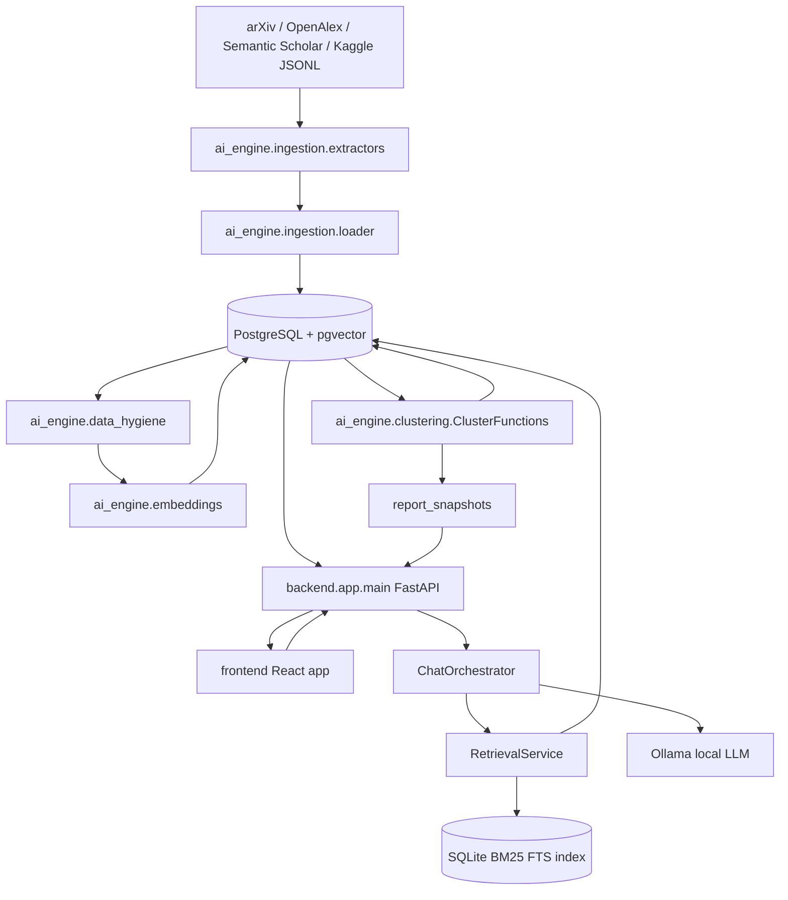
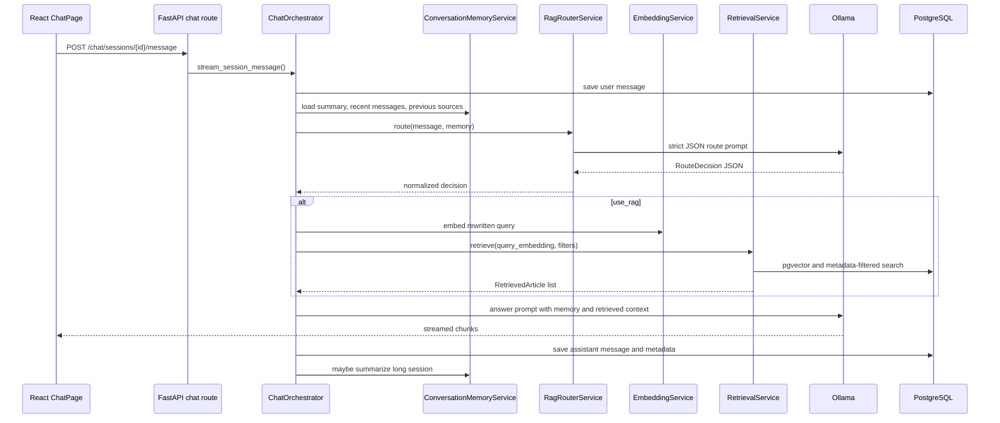

# Academic Platform System Working Details

This document explains how the current codebase is organized and how the main modules work together. It is written from the implementation in this repository, not only from the high-level project description.

## 1. System Purpose

The project is an academic literature intelligence platform. It collects computer-science-oriented papers from external academic sources, stores normalized metadata in PostgreSQL, creates semantic embeddings, clusters papers into research topics, builds analytics and bulletin snapshots, and exposes a RAG-backed chat assistant through a FastAPI API and a React frontend.

At a high level, the platform has two main execution modes:

1. Offline data/AI pipeline
   - Fetch papers from arXiv, OpenAlex, Semantic Scholar, or a Kaggle arXiv metadata snapshot.
   - Normalize and upsert articles into PostgreSQL.
   - Clean and prepare paper text.
   - Generate embeddings with a SentenceTransformer model.
   - Run BERTopic clustering on precomputed embeddings.
   - Save topic assignments, cluster metadata, and dashboard snapshots.

2. Online application runtime
   - FastAPI serves chat, analytics, bulletin, auth, and health endpoints.
   - Chat uses Ollama plus local retrieval over the article database.
   - Analytics and bulletin endpoints mostly serve cached payloads from `report_snapshots`.
   - React renders chat, dashboard, bulletin, and authentication pages.

## 2. Top-Level Module Map

```text
.
+-- ai_engine/
|   +-- ingestion/          External source extractors and DB loading
|   +-- data_hygiene/       Text cleaning, deduplication, embedding text export
|   +-- embeddings/         SentenceTransformer embedding generation
|   +-- clustering/         BERTopic clustering and cluster persistence
+-- backend/
|   +-- app/
|   |   +-- api/routes/     FastAPI route definitions
|   |   +-- core/           Settings and DB session helpers
|   |   +-- schemas/        Pydantic API/RAG schemas
|   |   +-- services/       Business logic and AI orchestration
|   |   +-- evaluation/     Retrieval/clustering evaluation utilities
|   +-- worker/             Minimal Celery skeleton
+-- database/
|   +-- models/             SQLAlchemy ORM models
|   +-- alembic/            Database migrations
+-- frontend/
|   +-- src/                Vite + React + TypeScript client
+-- scripts/                Operational/evaluation scripts
+-- evaluation/             Golden sets and evaluation data
+-- docs/                   Project documentation
+-- tests/                  Unit and integration-style tests
```

## 3. Runtime Architecture



Important relationship: the online dashboard and bulletin pages are useful only after the offline pipeline has populated `articles.embedding`, `articles.cluster_id`, `clusters`, and `report_snapshots`. Ingestion alone is not enough for the full product experience.

## 4. Configuration and Infrastructure

### Settings

The central settings object is `backend/app/core/config.py`.

Key settings:

- `DATABASE_URL`: SQLAlchemy connection string.
- `OLLAMA_BASE_URL`: Ollama server URL.
- `MODEL_NAME`: LLM model used by Ollama.
- `EMBEDDING_MODEL_NAME`: SentenceTransformer model, default `intfloat/multilingual-e5-base`.
- `EMBEDDING_DEVICE`: `auto`, `cuda`, `mps`, or `cpu`.
- `RAG_RETRIEVAL_MODE`: `hybrid`, `vector`, or `bm25`.
- `RAG_FUSION_METHOD`: `rrf` or `weighted`.
- `RAG_RERANKER_ENABLED`: controls cross-encoder reranking.
- `CHAT_HISTORY_LIMIT` and `CHAT_SUMMARY_TRIGGER_MESSAGES`: conversation memory limits.

### Docker Compose

`docker-compose.yml` defines:

- `postgres`: `pgvector/pgvector:pg16`.
- `redis`: Redis broker/result backend for Celery services.
- `backend`: FastAPI container, exposes port `8000`, mounts `exports/retrieval` read-only for BM25.
- `worker`: Celery worker container.
- `beat`: Celery beat scheduler container.
- `ollama`: local LLM runtime container.
- `ollama-pull`: one-shot model pull and warm-up container.
- `frontend`: Vite app, exposes port `5173`.

Ollama is containerized in the main compose file. The backend and worker reach it through the in-network `ollama` service when running in Docker.

### Database Session Management

`backend/app/core/database.py` creates:

- `engine = create_engine(settings.DATABASE_URL, pool_pre_ping=True)`
- `SessionLocal`
- `get_db()` FastAPI dependency

`database/db.py` exposes the shared declarative `Base` and imports the same `SessionLocal` and `engine`.

## 5. Database Model

The database schema is represented by SQLAlchemy models in `database/models/` and Alembic migrations in `database/alembic/versions/`.

### Main Tables

#### `articles`

Model: `database/models/ArticleData.py`

Purpose: canonical paper store.

Important fields:

- Source identity: `source`, `external_id`
- Paper metadata: `title`, `abstract_text`, `publish_date`, `updated_date`, `authors`
- Links and IDs: `url`, `pdf_url`, `doi`
- Classification metadata: `primary_category`, `categories`, `venue`, `citation_count`
- Embedding fields: `embedding`, `embedding_model`, `embedding_text_hash`, `embedding_created_at`
- Normalized metadata: `metadata_json`, `language`, `document_type`, `ingestion_run_id`
- Topic assignment: `cluster_id`

`embedding` is a pgvector `Vector(768)`, matching the default multilingual E5 base model dimension.

#### `clusters`

Model: `database/models/ClusterData.py`

Purpose: stores BERTopic topics.

Important fields:

- `cluster_id`: BERTopic topic ID.
- `cluster_description`: short LLM-generated topic name or keyword fallback.
- `article_count`: number of assigned articles.
- `article_ids`: comma-separated assigned article IDs.
- `representative_docs`: comma-separated representative article IDs.
- `metadata_json`: keywords, representative scores, source distribution, date range.

#### `cluster_digests`

Model: `database/models/ClusterDigest.py`

Purpose: cached natural-language summaries for clusters.

Important fields:

- `cluster_id`
- `period_start`, `period_end`
- `summary`
- `highlights_json`
- `representative_article_ids_json`

#### `report_snapshots`

Model: `database/models/ReportSnapshot.py`

Purpose: cache expensive dashboard, bulletin, and weekly bulletin payloads.

Important fields:

- `snapshot_key`: unique cache key.
- `payload_json`: full API-ready payload.
- `metadata_json`: cache kind, filters, version, status.
- `generated_at`

#### `users`, `chat_sessions`, `chat_messages`

Models:

- `database/models/User.py`
- `database/models/ChatSession.py`
- `database/models/ChatMessage.py`

Purpose:

- Store local users.
- Store chat sessions.
- Store user and assistant messages.
- Store assistant RAG metadata in `chat_messages.metadata_json`, including route decisions, retrieval filters, and cited sources.

The app uses `role='agent'` in the database and converts it to `assistant` in API responses.

#### `user_bulletin_preferences`

Model: `database/models/UserBulletinPreference.py`

Purpose: stores each user's selected clusters/categories for personalized bulletin generation.

## 6. Offline Data and AI Pipeline

The offline pipeline is the source of the data used by the online app.

### 6.1 Ingestion

Entry point: `run_bulk_ingest.py`

Supporting modules:

- `ai_engine/ingestion/extractors/base.py`
- `ai_engine/ingestion/extractors/arxiv_extractor.py`
- `ai_engine/ingestion/extractors/openalex_extractor.py`
- `ai_engine/ingestion/extractors/s2_extractor.py`
- `ai_engine/ingestion/schemas.py`
- `ai_engine/ingestion/loader.py`
- `ai_engine/ingestion/state_manager.py`

Flow:

1. `run_bulk_ingest.py` parses source, query, max result, and state reset arguments.
2. It builds source extractors from `EXTRACTOR_FACTORIES`.
3. Each extractor returns normalized `RawArticleSchema` objects.
4. `save_articles_to_db()` converts schemas to `articles` rows.
5. The loader filters for computer-science-like records.
6. Rows with missing required `source`, `external_id`, `title`, or `abstract_text` are skipped.
7. PostgreSQL `INSERT ... ON CONFLICT` upserts by `external_id`.
8. Cursor/checkpoint state is saved in `ai_engine/ingestion/ingestion_state.json`.

Extractor behavior:

- `ArxivExtractor`
  - Queries `cat:cs.*`.
  - Pages backward month by month.
  - Handles request interval, retries, 429s, and checkpointing.
  - Parses Atom XML into `RawArticleSchema`.

- `OpenAlexExtractor`
  - Filters by OpenAlex Computer Science concept ID.
  - Uses cursor pagination.
  - Reconstructs abstracts from `abstract_inverted_index`.
  - Stores OpenAlex IDs and open access metadata.

- `SemanticScholarExtractor`
  - Uses Semantic Scholar Graph API search.
  - Requests paper metadata, external IDs, citation counts, venue, and open access PDF.
  - Handles simple 429 retry behavior.

Alternative ingestion:

- `run_kaggle_arxiv_ingest.py` imports a Kaggle arXiv JSONL snapshot.
- It can sample by month/year, dry-run, and write batches through the same loader logic.

### 6.2 Data Hygiene

Main files:

- `ai_engine/data_hygiene/text_preparation.py`
- `ai_engine/data_hygiene/export_clean_papers.py`

Purpose:

- Remove bad records before embedding/clustering.
- Produce clean text columns for embedding and BERTopic.
- Export CSVs under `exports/data_hygiene`.

Important cleaning rules:

- Title must be longer than `TITLE_MIN_CHARS`.
- Abstract must be longer than `ABSTRACT_MIN_CHARS`.
- Duplicate records are detected by IDs and normalized title.
- Abstracts are truncated to `ABSTRACT_MAX_WORDS`.
- Academic boilerplate phrases are removed from representation text.
- Survey/review papers are tagged using title terms.
- Optional language filtering keeps English records.

Generated text fields:

- `title_clean`
- `abstract_clean`
- `abstract_truncated`
- `embedding_text`
- `representation_text`
- `is_survey`
- `category_family`

The embedding path should use `embedding_text`. BERTopic document representation should use `representation_text`.

### 6.3 Embeddings

Main files:

- `backend/app/services/embedding_service.py`
- `ai_engine/embeddings/embeddings_to_db.py`
- `ai_engine/embeddings/model.py`

Model:

- Default: `intfloat/multilingual-e5-base`
- Output dimension: 768
- Query text prefix: `query: ...`
- Passage text prefix: `passage: ...`

Flow:

1. `embeddings_to_db.py` prefers clean CSV exports.
2. It reads `embedding_text` from clean paper CSVs.
3. It wraps text with the E5 `passage:` prefix.
4. It computes a SHA-256 hash of the embedding input.
5. It skips articles whose `embedding_model` and `embedding_text_hash` already match.
6. It writes `embedding`, `embedding_model`, `embedding_text_hash`, and `embedding_created_at`.

If clean CSVs are unavailable, it can scan raw DB articles and apply lightweight title/abstract validity checks.

### 6.4 Clustering

Main file: `ai_engine/clustering/ClusterFunctions.py`

Purpose:

- Cluster embedded articles into research topics.
- Save topic assignments to `articles.cluster_id`.
- Save topic metadata to `clusters`.
- Refresh default report snapshots after a successful DB save.

Flow:

1. Resolve a runtime profile for CPU/thread/memory settings.
2. Load clean articles from CSVs when available, or fallback to raw DB mode.
3. Verify that clean CSV embedding text hashes match DB `embedding_text_hash`.
4. Build document texts from `representation_text`.
5. Run BERTopic with:
   - Precomputed embeddings.
   - UMAP with cosine metric.
   - HDBSCAN.
   - CountVectorizer with English plus custom academic stopwords.
   - c-TF-IDF with `reduce_frequent_words=True`.
6. Optionally reduce topic count.
7. Optionally reassign high-confidence outliers.
8. Write output artifacts to `exports/bertopic`.
9. Replace DB cluster rows and article topic assignments.
10. Refresh default analytics and bulletin snapshots.

Cluster metadata includes:

- Cleaned keywords.
- Representative article IDs.
- Representative article centrality scores.
- Top categories.
- Source distribution.
- Date range.
- Build timestamp.

Cluster names are generated through Ollama. If Ollama is unavailable, the code falls back to keyword strings.

## 7. FastAPI Backend

Entry point: `backend/app/main.py`

It creates the FastAPI app, configures CORS for local Vite origins, and includes routers:

- `health_router`
- `auth_router`
- `chat_router`
- `analytics_router`
- `bulletin_router`

`backend/app/api/server.py` simply re-exports `app` for server runners.

### API Routes

#### Health

File: `backend/app/api/routes/health.py`

- `GET /health`
- Returns `{"status": "ok"}`.

#### Auth

File: `backend/app/api/routes/auth.py`

- `POST /auth/signup`
- `POST /auth/login`

The current implementation stores SHA-256 password hashes and returns a simple user object. There is no JWT/session token. The frontend stores the user in local storage and sends `X-User-Id`.

#### Chat

File: `backend/app/api/routes/chat.py`

Endpoints:

- `GET /chat/sessions`
- `POST /chat/sessions`
- `DELETE /chat/sessions/{session_id}`
- `GET /chat/sessions/{session_id}/messages`
- `POST /chat/sessions/{session_id}/message`
- `POST /chat` legacy fallback

The streaming endpoint calls `ChatOrchestrator.stream_session_message()` and returns `StreamingResponse` with `text/plain`.

If `X-User-Id` is missing or invalid for chat routes, the backend falls back to a `default_user`.

#### Analytics

File: `backend/app/api/routes/analytics.py`

- `GET /analytics`

Query parameters:

- `force_refresh`
- `source`
- `category`
- `period`: `3m`, `6m`, `12m`, or `all`

Uses `ReportSnapshotService.get_analytics()`.

#### Bulletin

File: `backend/app/api/routes/bulletin.py`

Endpoints:

- `GET /bulletin/options`
- `GET /bulletin/me`
- `POST /bulletin/me`
- `GET /bulletin/weeks-best/selections`
- `GET /bulletin/weeks-best`
- `POST /bulletin/weeks-best/generate`
- `GET /bulletin`
- `GET /bulletin/articles/{article_id}`
- `GET /bulletin/clusters/{cluster_id}/digest`

Unlike chat, several bulletin user-specific endpoints require a valid `X-User-Id` and return `401` if it is missing.

## 8. RAG Chat Flow

Main files:

- `backend/app/services/chat_orchestrator.py`
- `backend/app/services/rag_router_service.py`
- `backend/app/services/conversation_memory_service.py`
- `backend/app/services/retrieval_service.py`
- `backend/app/services/embedding_service.py`
- `backend/app/services/ollama_service.py`
- `backend/app/schemas/retrieval.py`
- `backend/app/schemas/source.py`

### End-to-End Flow



### Route Decision

`RagRouterService` decides whether a user message needs local database retrieval.

It asks Ollama for strict JSON:

- `use_rag`
- `reason`
- `rewritten_query`
- `filters`
- `top_k`
- `sort_by`

Supported filters:

- `source`
- `cluster_id`
- `primary_category`
- `categories_any`
- `venue`
- `doi`
- `has_pdf`
- `min_citation_count`
- `publish_date_from`
- `publish_date_to`
- `article_ids`

Supported sort modes:

- `relevance`
- `publish_date_desc`

If Ollama routing fails, deterministic fallback routing is used. The fallback checks RAG keywords, academic search patterns, references to previous sources, category patterns like `cs.AI`, DOI patterns, PDF requests, citation thresholds, date windows, and top-k requests.

### Conversation Memory

`ConversationMemoryService` loads:

- Session summary from `chat_sessions.summary`.
- Recent messages from `chat_messages`.
- Previous cited sources from assistant message metadata.

This enables follow-up questions like:

- "Summarize S2."
- "Show PDFs among those."
- "What about the second paper?"

After enough messages, it asks Ollama to summarize the session and stores the result in `chat_sessions.summary`.

### Retrieval

`RetrievalService` supports three modes:

- `vector`: pgvector cosine search only.
- `bm25`: SQLite FTS BM25 only.
- `hybrid`: vector plus BM25, then fusion.

Vector retrieval:

- Uses `Article.embedding.cosine_distance(query_embedding)`.
- Applies SQL-level metadata filters.
- Converts distance to similarity.

BM25 retrieval:

- Uses a SQLite FTS index at `settings.RAG_BM25_INDEX_PATH`.
- The index is expected to contain `articles_fts` and `index_metadata`.
- The service checks whether the BM25 index fingerprint matches the current DB article counts.
- If the index is missing/stale/unusable, hybrid mode can fall back to vector-only retrieval.

Hybrid fusion:

- Default `rrf`: reciprocal rank fusion using `RAG_RRF_K`.
- Optional `weighted`: min-max normalized weighted score fusion with `RAG_WEIGHTED_ALPHA`.

Reranking:

- If enabled, `CrossEncoderReranker` reranks fused candidates with `cross-encoder/ms-marco-TinyBERT-L2-v2` by default.
- If reranking fails, retrieval falls back to fused ranking.

Special retrieval paths:

- `publish_date_desc` returns latest matching articles.
- Small `article_ids` lists use direct lookup for follow-up questions about previous sources.

### Answer Generation

`ChatOrchestrator` builds an answer prompt containing:

- Conversation memory.
- Route decision JSON.
- Retrieval status.
- Retrieved context from `build_rag_context()`.
- Citation/source formatting instructions.
- User message.

For RAG answers, the assistant is instructed to cite paper-specific claims with `[S1]`, `[S2]`, etc. If the model does not produce a sources section, the orchestrator appends one using retrieved source metadata.

The assistant message is saved with metadata:

- Whether RAG was used.
- Model name.
- Full route decision.
- Retrieval filters.
- Source references.

## 9. Analytics and Snapshot Flow

Main file: `backend/app/services/report_snapshot_service.py`

Analytics is generated from `articles` and `clusters`, then cached in `report_snapshots`.

Analytics payload includes:

- `timeRange`
  - reference date
  - period start/end
  - minimum publish date
- `metrics`
  - total papers
  - active clusters
  - average papers per cluster
  - weekly picks
  - clustered papers
- `barData`, `pieData`, `scatterData`
- `monthlyData`
- `clusters`
- `categoryOptions`
- `clusterTrendSeries`
- `risingTopics`
- `filteredClusterQuality`
- `globalClusterQuality`

Snapshot keys are deterministic hashes of filters such as source, category, and period. Analytics snapshots also store a `dataFingerprint`; stale fingerprints force refresh.

Default snapshots are refreshed after clustering through `Cluster._refresh_report_snapshots()`.

## 10. Bulletin System

There are two bulletin concepts in the codebase:

1. General/user bulletin
   - Generated from clusters and representative papers.
   - Served by `/bulletin` and `/bulletin/me`.
   - Cached in `report_snapshots`.

2. Week's Best bulletin
   - Generated for a selected cluster or category and week range.
   - Served by `/bulletin/weeks-best`.
   - Uses explicit candidate selection, scoring, diversity, card creation, optional LLM writing, and validation.

### General Bulletin

Main files:

- `backend/app/services/report_snapshot_service.py`
- `backend/app/services/user_bulletin_service.py`
- `backend/app/services/digest_service.py`

Flow:

1. User selects clusters or categories in the frontend.
2. `UserBulletinService.save_preference()` stores the preference.
3. `ReportSnapshotService.refresh_bulletin_snapshot()` builds a bulletin payload.
4. The snapshot key is saved in `user_bulletin_preferences`.
5. Later reads load the cached snapshot unless `force_refresh` is true.

Cluster digests:

- `DigestService.get_or_create_cluster_digest()` selects representative articles.
- It can use Ollama for a summary.
- If Ollama is disabled or fails, it produces a deterministic summary.
- Results are cached in `cluster_digests`.

### Week's Best Bulletin

Main files:

- `backend/app/services/bulletin_snapshot_service.py`
- `backend/app/services/bulletin_candidate_service.py`
- `backend/app/services/bulletin_scoring_service.py`
- `backend/app/services/bulletin_diversity_service.py`
- `backend/app/services/bulletin_card_service.py`
- `backend/app/services/bulletin_generation_service.py`
- `backend/app/services/bulletin_validation_service.py`

Flow:

1. Resolve selection:
   - `cluster` selection resolves to a cluster ID and label.
   - `category` selection resolves to a category string.
2. Fetch candidates in the selected week.
3. Filter candidates with short abstracts.
4. Score candidates using weighted components:
   - relevance
   - centrality
   - quality
   - citation
   - recency
   - novelty
   - source quality
5. Select a diverse set with MMR-like logic over embedding similarity.
6. Convert selected papers into source cards.
7. Generate bulletin markdown:
   - Optional Ollama writer prompt.
   - Deterministic fallback writer.
8. Validate:
   - required sections exist
   - source IDs are known
   - citations exist
   - duplicate article IDs are absent
   - selected papers are inside the week
9. Cache the payload in `report_snapshots`.

This subsystem is intentionally source-grounded. Even when LLM writing is enabled, validation checks that generated markdown cites only selected source IDs.

## 11. Frontend

Main files:

- `frontend/src/App.tsx`
- `frontend/src/api/client.ts`
- `frontend/src/lib/auth.ts`
- `frontend/src/pages/ChatPage.tsx`
- `frontend/src/pages/DashboardPage.tsx`
- `frontend/src/pages/BulletinPage.tsx`
- `frontend/src/pages/AuthPage.tsx`
- `frontend/src/components/Layout.tsx`
- `frontend/src/components/RequireAuth.tsx`

### Routing

`App.tsx` defines:

- `/auth`
- `/session/new`
- `/session/:sessionId`
- `/dashboard`
- `/bulletin`

`RequireAuth` protects chat, dashboard, and bulletin pages.

### API Client Behavior

`frontend/src/api/client.ts` derives the backend base URL from the browser hostname and uses port `8000`.

Authentication is lightweight:

- Login/signup returns user ID, username, email.
- `frontend/src/lib/auth.ts` stores that object in local storage.
- API requests send `X-User-Id`.

### Chat Page

`ChatPage.tsx`:

- Creates sessions through `POST /chat/sessions`.
- Fetches prior messages from `GET /chat/sessions/{id}/messages`.
- Sends messages to `POST /chat/sessions/{id}/message`.
- Reads streaming chunks from `response.body.getReader()`.
- Updates the last assistant message incrementally.
- Uses an inactivity timeout and abort controller.

### Dashboard Page

`DashboardPage.tsx`:

- Calls `GET /analytics`.
- Supports category and period filters.
- Renders metrics, rising topics, cluster quality, trends, pie charts, scatter charts, and cluster lists.

It expects the analytics snapshot schema produced by `ReportSnapshotService`.

### Bulletin Page

`BulletinPage.tsx`:

- Fetches options from `GET /bulletin/options`.
- Fetches user bulletin from `GET /bulletin/me`.
- Saves preferences with `POST /bulletin/me`.
- Generates/fetches Week's Best bulletins through `/bulletin/weeks-best`.
- Displays normalized cluster groups, paper cards, digests, and markdown bulletin output.

## 12. Evaluation and Test Support

### Backend Evaluation Modules

`backend/app/evaluation/` contains:

- retrieval metrics
- clustering metrics
- clustering experiments
- RAG golden set evaluation support
- report writing
- cluster postprocessing helpers

### Scripts

Useful scripts include:

- `scripts/build_bm25_index.py`: builds the SQLite FTS/BM25 index used by hybrid retrieval.
- `scripts/run_rag_golden_set_evaluation.py`: runs RAG golden set evaluation.
- `scripts/run_answer_evaluation.py`: evaluates generated answers.
- `scripts/run_clustering_experiments.py`: clustering experiment runner.
- `scripts/compare_clustering.py`: compares clustering outputs.
- `scripts/export_cluster_topics.py`: exports topic data.
- `scripts/export_random_articles.py`: creates sampled article exports.

### Tests

The `tests/` directory covers important contracts:

- AI pipeline functions.
- Retrieval service behavior.
- RAG router behavior.
- Chat orchestrator.
- Conversation memory.
- Analytics contract.
- Report snapshot service.
- Evaluation metrics.

## 13. Operational Sequence

A typical local data build should happen in this order:

```bash
# 1. Start PostgreSQL, Redis, Ollama, backend, worker, beat, and frontend
./setup.sh

# 2. Ingest papers
docker compose run --rm --no-deps --entrypoint python backend /app/run_bulk_ingest.py --sources arxiv,openalex --max-results 1000

# 3. Export clean paper text, optional
docker compose run --rm --no-deps --entrypoint python backend /app/ai_engine/data_hygiene/export_clean_papers.py --include-all-sources

# 4. Generate embeddings
docker compose run --rm --no-deps --entrypoint python backend /app/ai_engine/embeddings/embeddings_to_db.py --total-articles 1000 --batch-size 100

# 5. Build BM25 index for hybrid retrieval
docker compose run --rm --no-deps --entrypoint python backend /app/scripts/build_bm25_index.py

# 6. Cluster embedded papers
docker compose run --rm --no-deps --entrypoint python backend /app/ai_engine/clustering/ClusterFunctions.py --max-articles 1000 --min-topic-size 20

# 7. Run tests through the backend image
docker compose run --rm --no-deps --entrypoint pytest backend tests
```

The exact article counts and clustering parameters should be adjusted for the available dataset size and hardware.

## 14. Key Design Relationships

- `articles` is the central table. Almost every feature depends on it.
- `articles.embedding` enables vector retrieval, clustering, representative scoring, and diversity selection.
- `articles.cluster_id` links raw papers to topic clusters and powers analytics/bulletins.
- `clusters.metadata_json` stores representative paper IDs and scores used by digests and bulletins.
- `report_snapshots` decouples expensive analytics/bulletin generation from frontend page loads.
- `chat_messages.metadata_json` preserves RAG traceability for follow-up questions.
- The BM25 index is outside PostgreSQL, so it must be rebuilt when article data changes enough to make the fingerprint stale.
- Ollama is used in multiple places:
  - route decisions
  - chat answers
  - conversation summaries
  - cluster names
  - optional cluster digests
  - optional Week's Best prose

## 15. Current Implementation Notes and Risks

These points matter when maintaining or extending the project:

- Authentication is not token-based. The frontend trusts local storage and sends `X-User-Id`.
- Password hashing uses raw SHA-256 in the current implementation; production systems should use a password hashing algorithm such as bcrypt or Argon2.
- Chat and bulletin user resolution are inconsistent:
  - chat can fall back to `default_user`
  - bulletin user-specific endpoints require `X-User-Id`
- `backend/worker` is wired into Docker Compose, but the chat/RAG request path still runs synchronously through the backend service.
- BM25 retrieval depends on an external SQLite index under `exports/retrieval`.
- The clustering save path deletes old clusters and clears all `Article.cluster_id` values before writing new assignments.
- Data hygiene CSVs and DB embeddings must stay hash-aligned; clustering skips stale rows.
- Ollama availability affects route decisions, answer generation, cluster naming, and optional summary generation. Several modules have deterministic fallbacks, but chat answer generation still needs Ollama for normal responses.

## 16. Practical Mental Model

Think of the system as four layers:

1. Knowledge base layer
   - `articles`, embeddings, clusters, digests, snapshots.

2. AI processing layer
   - ingestion, hygiene, embeddings, BERTopic, BM25 index, evaluation scripts.

3. Application service layer
   - FastAPI routes plus services for RAG, analytics, bulletin, memory, and Ollama.

4. User interface layer
   - React pages for chat, dashboard, bulletin configuration, and authentication.

The most important dependency chain is:

```text
ingestion -> hygiene -> embeddings -> clustering -> snapshots -> frontend analytics/bulletin
                                  \-> retrieval -> chat RAG
```

If a feature appears empty or low quality, identify which stage in this chain is missing or stale. For example:

- No chat sources: embeddings missing, BM25 stale, or filters too strict.
- Empty dashboard clusters: clustering has not run or `cluster_id` values are missing.
- Empty bulletin: user preference has no matching clusters/categories or snapshot was not refreshed.
- Weak topic names: Ollama failed during clustering and keyword fallback was used.
- Slow chat: embedding model, Ollama, BM25 index, or cross-encoder reranker may be the bottleneck.
